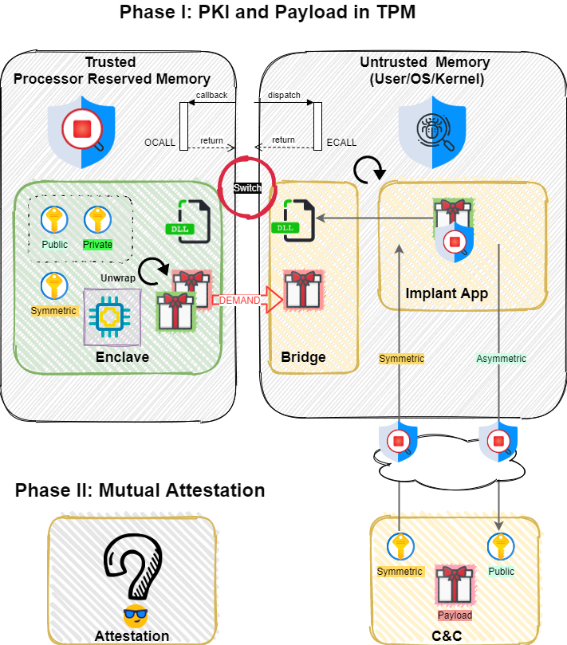

# Uncle Abe (offensive enclave system)

`enclave` _(/ankleiv/)_ -> _Uncle Abe_  .... well, not exactly a pinnacle of imagination (or wit) :). Have to ask James Albany for the name.
Anyway, a code name for the project to fully offload wrapping/unwrapping of offensive payloads with 
Intel SGX technology assist.

Intel SGX runs trusted code in a protected processor memory, via secure enclave technology. 
The trusted code is by design devoid of syscalls, I/O or any communication to the outside world (Ring 3/Ring2), OS/VM hypervisors unless declared data is marshalled to and from trusted context via a hardware switch handoff under a specifically described contract. Essentially, the code has a split personality: half of it is trusted, the other half is untrusted. 

One idea was to stash offensive payloads in the trusted code. You cannot run payloads or interface with OS process memory from there by design but you can perform computation, such as storing sensitive data like keys, seal data and export it out into the wild (userland) in a processor specific manner (encrypted/sealed by the key flashed into the processor).

So if we can stash data, one logical progression would be to also implement logic for key negotiation by the implant to the C&C in a manner that does not expose encryption keys in flight, memory or storage on the OS, _or expose encryption code itself outside the trusted enclave._ This, with minimal additional dependencies and crypto libraries to minimize footprint.

Uncle Abe Phase I is such a system, layering PKI negotiations for encryption keys with the SGX assist. The layering is done to also allow dynamic loads of enclave runtime management into implants. One such reference implementation of an implant and a C&C is presented here. 

- [App/Bridge/Enclave Code](https://dev.azure.com/proseclabs/Lab%20Development/_git/UncleAbe)

- Server C&C code will be linked later

## High level architecture:

